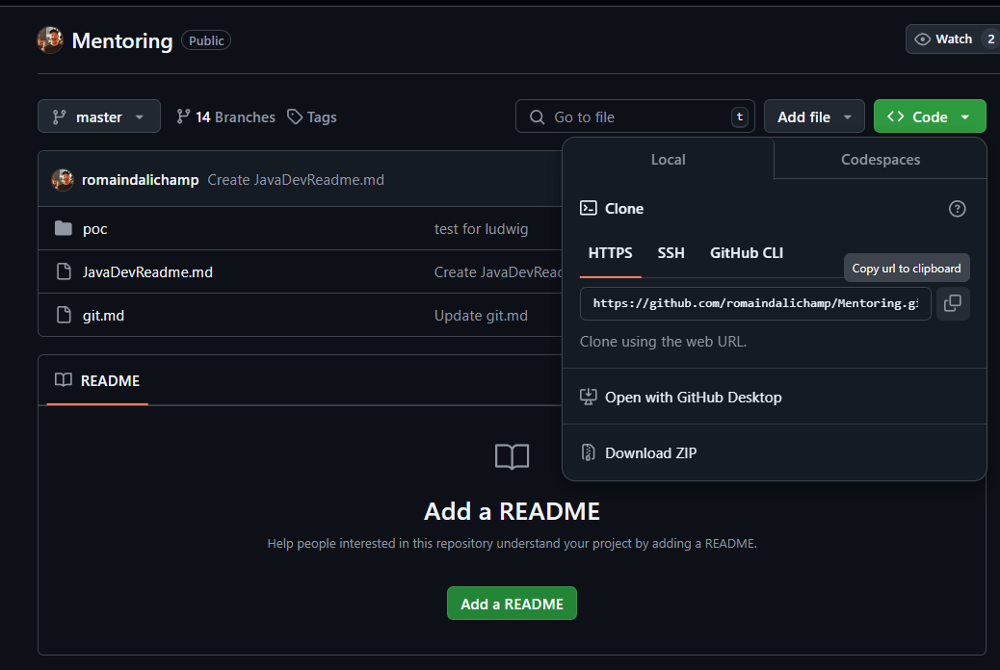
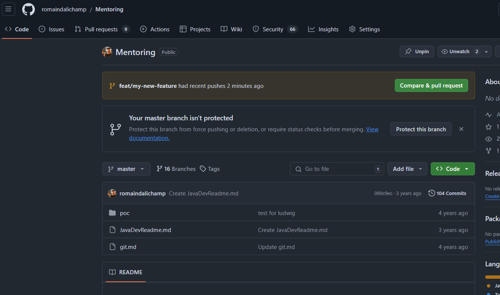
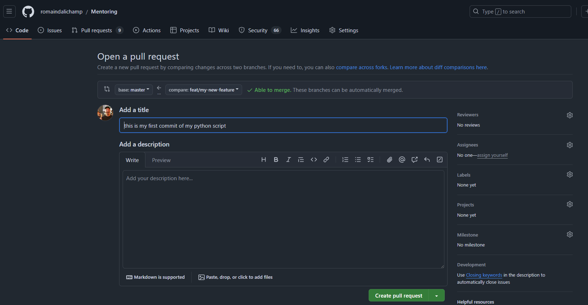
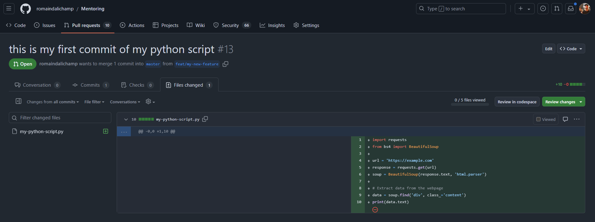
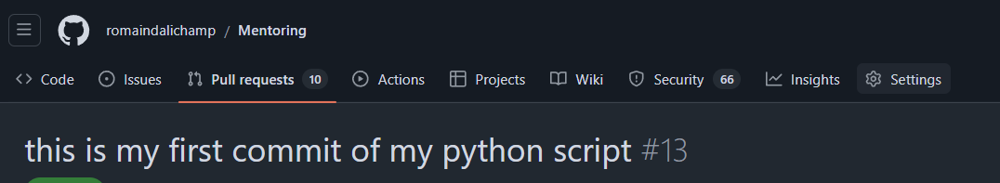
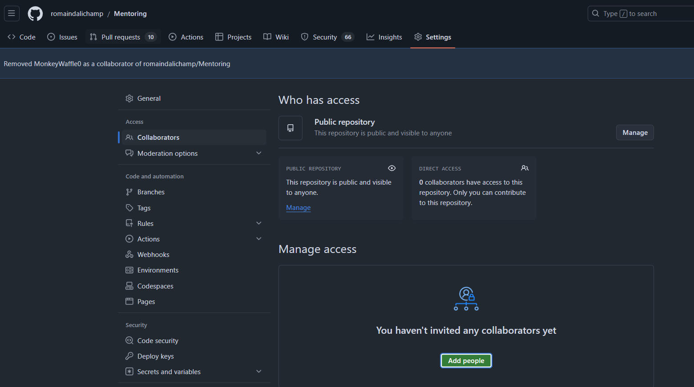

<table><tbody><tr><td>Cheat Sheet</td><td>https://github.github.com/training-kit/downloads/github-git-cheat-sheet.pdf</td></tr><tr><td>Practice</td><td>https://learngitbranching.js.org/?locale=fr_FR</td></tr><tr><td>Branching</td><td>https://nvie.com/posts/a-successful-git-branching-model/</td></tr></tbody></table>

# Main Road Map

*   **Local** = the local repository on each developer computer
*   **Origin/dev** = distant "dev" repository shared between each developer

# Github

Create a new repository on Github here: https://github.com/new
IMPORTANT: for now, you want it to be Public ! So just chose a name, and let all the options by default

When it is created, copy the HTTPS address


If not installed, follow the steps to install GIT on the local computer

## Install Git
Install Git for Windows or Linux: https://git-scm.com/downloads

# Clone the repository

Clone the repository, for example here in `C:\workspace\` directory.
In the next steps, replace `name-of-gihtub-repository` with the name you chose in Github

```shell
cd C:\workspace\
git clone <https://address-copied-on-the-step-before>
cd C:\workspace\name-of-gihtub-repository
```

# First commit

Now, this repository is versioned and will track changes `C:\workspace\name-of-gihtub-repository`
We can see the `status` and the `current branch` by doing those two commands.

Get the status of the workspace
## Git Status
```shell
C:\workspace\name-of-gihtub-repository>git status
On branch master
Your branch is up to date with 'origin/master'.
```

## Git Branch
Get the current branch of the project
```shell
C:\workspace\name-of-gihtub-repository>git branch
* main
# could also be "master"
```

Do a commit means we want to send something to the `origin` repository. But first, we don't want to work on `main` branch because the is the production branch.

## Git checkout -b: Create a branch

Create a branch means, we are working on a new version of the code with changes that will improve `main` branch.
You can replace `feat/my-new-feature` by anything you want with no spaces. Here is a bit of reading if you want to go more in details https://dev.to/varbsan/a-simplified-convention-for-naming-branches-and-commits-in-git-il4
```shell
C:\workspace\name-of-gihtub-repository>git checkout -b feat/my-new-feature
Switched to a new branch 'feat/my-new-feature'
```
Now, you have created a branch in your local repository, and switched to it. 
If you re-do the command `git branch` you can see a different result than previously

```shell
C:\workspace\name-of-gihtub-repository>git branch
* feat/my-new-feature
  master
```

We have done changes in our local repository/computer, we want to share it we the distant repository.
The distant repository is always called `origin`.

To share those changes, we will use `git push`

## Git push

Let's try to push our changes to the distant repository `origin`
```shell
C:\workspace\name-of-gihtub-repository>git push
fatal: The current branch feat/my-new-feature has no upstream branch.
To push the current branch and set the remote as upstream, use

    git push --set-upstream origin feat/my-new-feature
```

We have an error, because our local git, don't know where to push our local branch to. We could push it to a distant branch with a different name if desired.
But generally, we don't want to change the name, but git is still giving an error to `inform` you that you have to confirm.
As it is usually the same branch name we are using, git is giving us an example of what would be the command to use, if we want to confirm the branch name we want to create in origin repository to be the same.

Let's copy/paste this command

```shell
C:\workspace\name-of-gihtub-repository>git push --set-upstream origin feat/my-new-feature
Total 0 (delta 0), reused 0 (delta 0)
remote:
remote: Create a pull request for 'feat/my-new-feature' on GitHub by visiting:
remote:      https://github.com/git-identifier/name-of-gihtub-repository/pull/new/feat/my-new-feature
remote:
remote: GitHub found 66 vulnerabilities on romaindalichamp/Mentoring's default branch (10 critical, 28 high, 24 moderate, 4 low). To find out more, visit:
remote:      https://github.com/git-identifier/name-of-gihtub-repository/security/dependabot
remote:
To https://github.com/git-identifier/name-of-gihtub-repository.git
 * [new branch]      feat/my-new-feature -> feat/my-new-feature
Branch 'feat/my-new-feature' set up to track remote branch 'feat/my-new-feature' from 'origin'.
```

Now, we are ready to start to work on the new version of `main` branch, but on our new branch `feat/my-new-feature`

## Git add

Now, this repository is correctly configured and ready to get our new files. Let's add files/script
Add anything you want into this folder `C:\workspace\name-of-gihtub-repository`. For example a python script, or all the files of your program

First, run the `git status` command we saw earlier and see the differences now

```shell
C:\workspace\name-of-gihtub-repository>git status
On branch feat/my-new-feature
Your branch is up to date with 'origin/feat/my-new-feature'.

Untracked files:
  (use "git add <file>..." to include in what will be committed)
        .idea/
        my-python-script.py
```

We want then to inform git, it has to track this script. There is a very useful command for this:
```shell
git add .
```

It is adding, all the files under `./` including our `my-python-script.py`

## Git commit -m

Now the files are tracked, we want to commit this/those files into a single commit with a custom message to share with other developers or to remember which modification we did
```shell
C:\workspace\name-of-gihtub-repository>git commit -m "this is my first commit of my python script"
[feat/my-new-feature b77292d] this is my first commit of my python script
 1 file changed, 0 insertions(+), 0 deletions(-)
 create mode 100644 img.png
```

let's do another `git status` command to see what changed

```shell
C:\workspace\name-of-gihtub-repository>git status
On branch feat/my-new-feature
Your branch is ahead of 'origin/feat/my-new-feature' by 1 commit.
  (use "git push" to publish your local commits)
```

Git confirm there is one commit ready to be pushed on the origin branch (the distant repository on Github). Let's do it.

```shell
C:\workspace\name-of-gihtub-repository>git push
Enumerating objects: 4, done.
Counting objects: 100% (4/4), done.
Delta compression using up to 12 threads
Compressing objects: 100% (3/3), done.
Writing objects: 100% (3/3), 45.77 KiB | 22.89 MiB/s, done.
Total 3 (delta 0), reused 0 (delta 0)
remote:
To https://github.com/git-identifier/name-of-gihtub-repository.git
   089c9ec..b77292d  feat/my-new-feature -> feat/my-new-feature
```

## Github Pull Request


Now our code is pushed on the distant repository, we can see it directly on Github.

Navigate to your new repository on Github, and see there is a new yell line proposing to create a new `Pull Request`

The pull request will help us to do a diff between `origin/main` branch and `origin/feat/my-new-feature` branch and alert if there is any conflict.





Let's click on `Compare & pull request`

For this time, we will not change anything, just scroll down and click on Create pull request button



Navigating to the `Files Changed` tab, you should see something like this:


## Get a Review

Now the code is waiting to be `merged` in `main` branch, you need a reviewer to comment your code.
Navigate to the settings of you repository


Add a new collaborator



## Continue

to continue to work on this project, you can use in the order
* `git status`
* `git add .`
* `git commit -m "..."`
* `git push`

and it will send the commits on this branch

If someone does a push on this branch, you will see it doing the `git status`
to download it's modification on you repository do:
* `git pull --rebase`

... more to come


[//]: # ()
[//]: # (## 1\. Local)

[//]: # ()
[//]: # (*   Create a branch for each new _**"Epic > User Story > Task"**_ named as _"**theNewBranchNamedWIthTaskReferenceNumber**"_)

[//]: # ()
[//]: # (```)

[//]: # (git checkout -b theNewBranchNamedWIthTaskReferenceNumber)

[//]: # (```)

[//]: # ()
[//]: # (*   **Commit** + Commit + Commit _...._)

[//]: # ()
[//]: # (```)

[//]: # (git commit -m "this message to explain my commit")

[//]: # (```)

[//]: # ()
[//]: # (*   **Pull** _from_)

[//]: # (    1.  **Merge** in local if necessary)

[//]: # (    2.  Commit if a merge happened)

[//]: # ()
[//]: # (```)

[//]: # (git pull origin theNewBranchNamedWIthTaskReferenceNumber)

[//]: # (```)

[//]: # ()
[//]: # (*   **Push** the branch with all the commits on "Origin")

[//]: # ()
[//]: # (```)

[//]: # (git push origin theNewBranchNamedWIthTaskReferenceNumber)

[//]: # (```)

[//]: # ()
[//]: # (## 2\. Origin/dev)

[//]: # ()
[//]: # (*   Assuming we are currently working on "**theNewBranchNamedWIthTaskReferenceNumber**", if not:)

[//]: # ()
[//]: # (```)

[//]: # (git checkout theNewBranchNamedWIthTaskReferenceNumber)

[//]: # (```)

[//]: # ()
[//]: # (*   Update the current local branch with the shared branch "dev" and last modifications. Do **merge** if needed)

[//]: # ()
[//]: # (```)

[//]: # (git pull origin dev)

[//]: # (```)

[//]: # ()
[//]: # (*   Push updated modifications on branch "theNewBranchNamedWIthTaskReferenceNumber")

[//]: # ()
[//]: # (```)

[//]: # (git push origin theNewBranchNamedWIthTaskReferenceNumber)

[//]: # (```)

[//]: # ()
[//]: # (# Create Pull Request)

[//]: # ()
[//]: # (On the choosen devops software, for now GitHub [https://docs.github.com/en/github/collaborating-with-issues-and-pull-requests/creating-a-pull-request]&#40;https://docs.github.com/en/github/collaborating-with-issues-and-pull-requests/creating-a-pull-request&#41;)

[//]: # ()
[//]: # (*   Create a **Pull Request** from _"theNewBranchNamedWIthTaskReferenceNumber"_ to _"dev"_)

[//]: # (    *   each Pull Request should be \< 300 lines)

[//]: # (*   then, review another Pull Request pending validation !)

[//]: # ()
[//]: # (# Pull Request Peer Review)

[//]: # ()
[//]: # (*   Architecture)

[//]: # (*   Implémentation)

[//]: # (*   Maintenability / Reusability)

[//]: # (*   Give Positive Comments)

[//]: # ()
# IntellijShortcuts

<table><tbody><tr><td>Commit on local</td><td>CTRL + K</td></tr><tr><td>Pull from Origin / Current Branch</td><td>CTRL + T</td></tr><tr><td>Push</td><td>CTRL &nbsp;+ Shift + T</td></tr></tbody></table>
